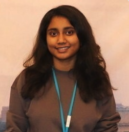

# Dharani Nadendla

Baltimore, MD | 410-800-5020 | dharann1@umbc.edu | [GitHub](https://github.com/Dharani-27) | [LinkedIn](https://www.linkedin.com/in/dharani-nadendla/)

## Education

**University of Maryland, Baltimore County** - Baltimore, MD, USA
MPS in Data Science, GPA 3.811, January 2025 to Present
Coursework: Introduction to Data Analysis and Machine Learning, Data Management

**Vellore Institute of Technology** - Andhra Pradesh, India
B.Tech, CSE with Specialization in Networking and Security, CGPA 8.39/10, August 2020 to May 2024
Coursework: Data Structures and Algorithms, Operating Systems, Database Management, Computer Networks

## Research Experience

**Video Watermarking** - UMBC
Advisor: Dr. Dong Li, September 2025 to Present

- Reviewed 10+ state-of-the-art research papers on video and audio watermarking to understand real-time embedding and robustness techniques.
- Implemented and evaluated 3 to 4 existing watermarking systems to study audio and video embedding processes.
- Exploring ultrasonic (>18 kHz) audio watermarking and AI-based adaptive strategies targeting 20 to 30% robustness improvement under compression and noise.

**Multimodal Earable Brain-Machine Interface** - UMBC
Advisor: Dr. Dong Li, September 2025 to Present

- Studying the research idea of a non-invasive earable Brain-Machine Interface (BMI) that leverages ear-EEG, EDA, and ultrasonic sensing for brain-state estimation.
- Reviewed 20+ research papers on ear-centered EEG, motion artifacts, and ultrasound-based in-ear sensing to understand robustness challenges in real-world use.
- Analyzing conceptual approaches for multimodal synchronization and AI-based fusion, based on existing literature and prior systems.

## Publication

**MASCOT: Analyzing Malware Evolution Through A Well-Curated Source Code Dataset** - UMBC
Advisor: Dr. Charles Nicholas, November 2025, arXiv: 2512.00741

- Analyzed malware evolution using around 6,000 real-world malware source-code samples across 20+ programming languages.
- Built a Python analytics pipeline with modular components for size, COCOMO cost, and code-quality metrics using CLOC and Lizard.
- Improved metric accuracy by about 25% through dynamic language detection and filtering of non-code artifacts; produced automated reports and interactive visualizations.

## Academic Projects

**Predicting Housing Prices in Baltimore Using Neighborhood and Crime Data** - GitHub, Fall 2025

- Built machine-learning models to predict housing prices using neighborhood-level crime, income, school, and demographic data. Performed data integration, feature engineering, and model evaluation (R2, RMSE, MAE).

## Leadership Experience

**Joint Director of Public Relations, Rotaract Club, VIT-AP** - June 2023 to December 2023

- Coordinated communications, managed social media updates, promoted club events, and supported outreach initiatives with partner organizations.

## Skills

Python, Matlab, Machine Learning, Signal Processing, Wireless and Acoustic Sensing, Malware Analysis
